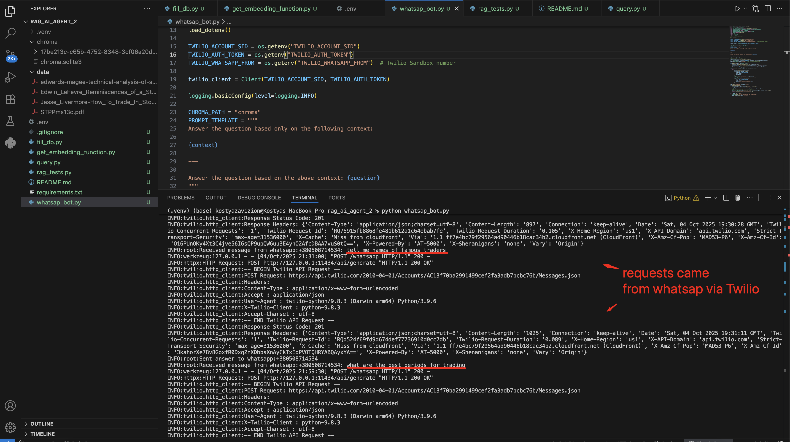
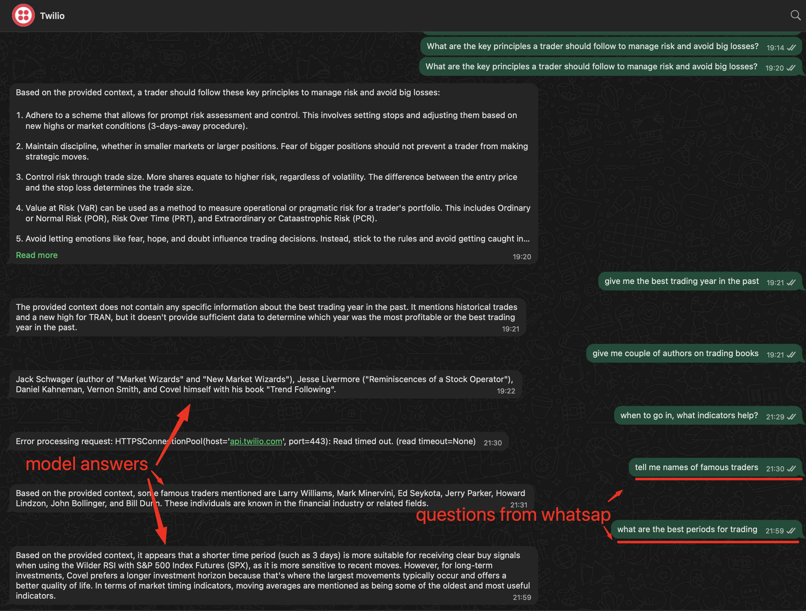

# 📈 WhatsApp RAG Bot for Stock Trading Knowledge

This project is a **Retrieval-Augmented Generation (RAG)** assistant that uses **Ollama models**, **LangChain**, **Chroma**, and **Twilio WhatsApp** to answer trading-related questions based on real trading literature.  
It can also **update the local vector database** with new books for continuous learning.
Can be easily unwrapped on cloud.

---

## 🚀 Features

- 📚 **Retrieval-Augmented Generation (RAG)**: answers questions based on real financial books.  
- 💬 **WhatsApp Integration**: interact directly with the bot through WhatsApp using **Twilio Sandbox**.  
- 🧠 **Local LLMs with Ollama**: fully offline text embedding and inference.  
- 🧩 **Database Updatable**: add new PDFs anytime without refreshing the entire database.  

## 📸 Screenshots

### WhatsApp RAG Bot in Action

---

## 📦 Installation

### 1️⃣ Clone the repository

  git clone https://github.com/Kostiantin/rag_ai_whatsap_trading_stocks_bot.git

  cd rag_ai_whatsap_trading_stocks_bot

### 2️⃣ Create a virtual environment and activate it

  python3 -m venv .venv

  source .venv/bin/activate

### 3️⃣ Install dependencies in virtual environment

  pip install langchain langchain-community langchain-text-splitters chromadb pypdf ollama boto3 botocore numpy flask twilio

## 📘 Download Reference Books

Download and place the following PDFs into your data/ folder (create it if it doesn’t exist):

[Reminiscences of a Stock Operator — Edwin LeFevre](https://www.trendfollowing.com/whitepaper/Edwin_LeFevre_Reminiscences_of_a_Stock_Operator.pdf)

[Securities Trading: Principles and Procedures — Joel Hasbrouck](https://pages.stern.nyu.edu/~jhasbrou/STPP/drafts/STPPms13c.pdf)

[How to Trade in Stocks — Jesse Livermore](https://www.trendfollowing.com/pdfs/Jesse_Livermore-How_To_Trade_In_Stocks_%281940_original%29-EN.pdf)

[Technical Analysis of Stock Trends — Edwards & Magee](https://vdthangmeomeo.wordpress.com/wp-content/uploads/2014/08/edwards-magee-technical-analysis-of-stock-trends-9th-edition.pdf)

## 🧠 Ollama Setup

Ollama must be installed globally, not inside your virtual environment.

### Install Ollama globally (not in virtual environment)

  brew install ollama

### Start Ollama server and keep it running

  ollama serve

### Pull required models

  ollama pull nomic-embed-text
  ollama pull mistral

### You can verify the models are installed with:

  ollama list

## 🗄️ Create and Update the Local Database

To build the Chroma vector database from your PDFs (pdf files should already be in data folder):

  python fill_db.py

This creates a local folder called chroma/ that stores all embeddings.
You can rerun this anytime to add new books.

## 💬 Test the Query System

Once the database is ready and Ollama models are running, test your setup:

  python query.py "What are the main principles of a stock trader?"

You should receive a relevant answer from the AI based on your loaded documents.

## 🌐 Run the WhatsApp Flask Server

Start your local Flask bot server in terminal 1:

  python whatsapp_bot.py

This will run on port 5000 (or 5001 if 5000 is taken).

## 🌍 Expose the Local Server with Ngrok

### Install Ngrok (globally not in virtual environment):

  brew install ngrok/ngrok/ngrok

### Connect your Ngrok account (go to ngrok website account and get api-token-here):

  ngrok config add-authtoken <your-api-token-here>

### Run Ngrok on port 5000 (or 5001) in terminal 2:

  ngrok http 5000

Copy your generated HTTPS URL from terminal 2 — you’ll use it for Twilio.
it will create url like this: https://fora-unaccouter-lynelle1.ngrok-fee.dev
you need to take this url add your link from whasap_bot.py from line @app.route("/whatsapp", methods=["POST"]) in my case it is /whatsapp
add it to the generated by ngrok url to be like this: https://fora-unaccouter-lynelle1.ngrok-fee.dev/whatsapp and add to Twilio

## 📱 Connect to Twilio WhatsApp Sandbox

### 1️⃣ Log in to [Twilio Console](https://console.twilio.com/?frameUrl=/console)

### 2️⃣ Set up WhatsApp sandbox

Go to Messaging → Try it Out → WhatsApp Sandbox.
Join the sandbox using the code Twilio provides (by sending it from your WhatsApp).

### 3️⃣ Configure Webhook

In the Sandbox Configuration, find:

“When a message comes in”

Paste your Ngrok URL plus /whatsapp, e.g.:

https://fora-unaccouter-lynelle1.ngrok-fee.dev/whatsapp

### 4️⃣ Add your Twilio credentials to .env

Create a .env file in the project root (or rename .example_env):

TWILIO_ACCOUNT_SID=ACxxxxxxxxxxxxxxxxxxxxxxxxxxxx
TWILIO_AUTH_TOKEN=your_auth_token_here
TWILIO_WHATSAPP_FROM=whatsapp:+1111111
MY_WHATSAPP_NUMBER=whatsapp:+2222222

## 🧩 Running Everything Together

Open three terminals:

Terminal 1:

  ollama serve

Terminal 2:

  source .venv/bin/activate

  python whatsapp_bot.py

Terminal 3:

  ngrok http 5000

Check the URL from Ngrok and make sure it matches the Twilio webhook configuration (including /whatsapp).

## ✅ Example Interaction

Send this message from your WhatsApp (connected to the sandbox):

  What are the key principles a trader should follow to manage risk and avoid big losses?

And you’ll receive an intelligent, book-based answer generated by Mistral through Ollama and retrieved via LangChain + Chroma.

## 🧰 Troubleshooting

Port 5000 in use → use another port (e.g. 5001) or stop the conflicting service.

Twilio error 21212 → check .env, ensure TWILIO_WHATSAPP_FROM includes whatsapp: prefix.

Ngrok timeout (11200) → ensure Flask is running and reachable via the same Ngrok URL.

Model not found (404) → verify ollama list contains both mistral and nomic-embed-text.
